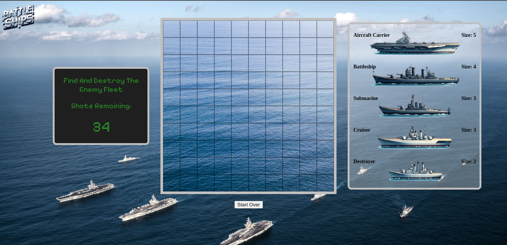
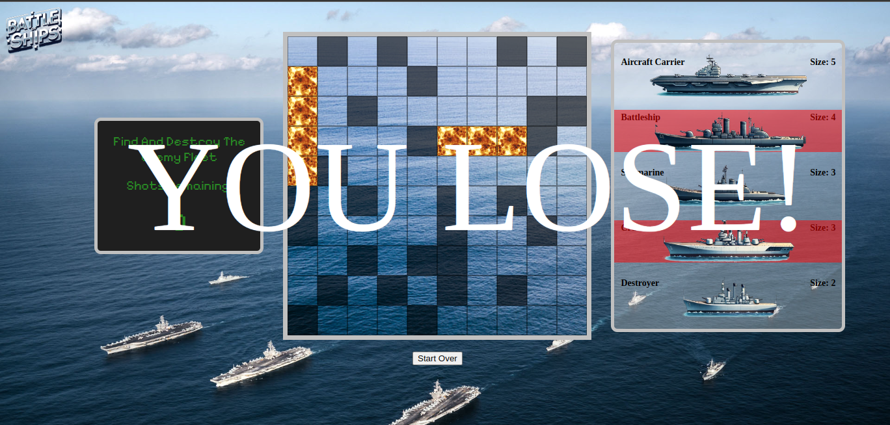

This is a game called Battle Of Ships that I made as my first project in the General Assembly software engineering immersive program. It is a version of Battleship.

Here are some screenshots...

This game was made with HTML, CSS and Javascript. All sounds and imagery used in the game are free of copyright.

Click here https://michaelbmoss.github.io/Battle-of-Ships/ to play the game. It is self-explanatory, especially if you've played Battleship before.

There are many ways to improve the game from here. It would be easy to add difficulty levels by changing the number of chances one gets to shoot the enemy fleet. It would be great to have a attack and defend mode instead of just an attack mode. The code could be refactored.
