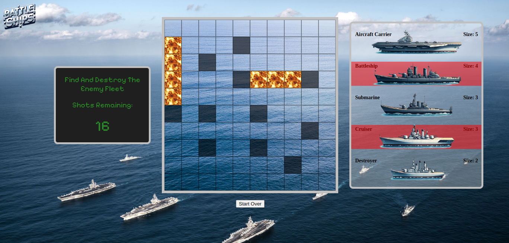
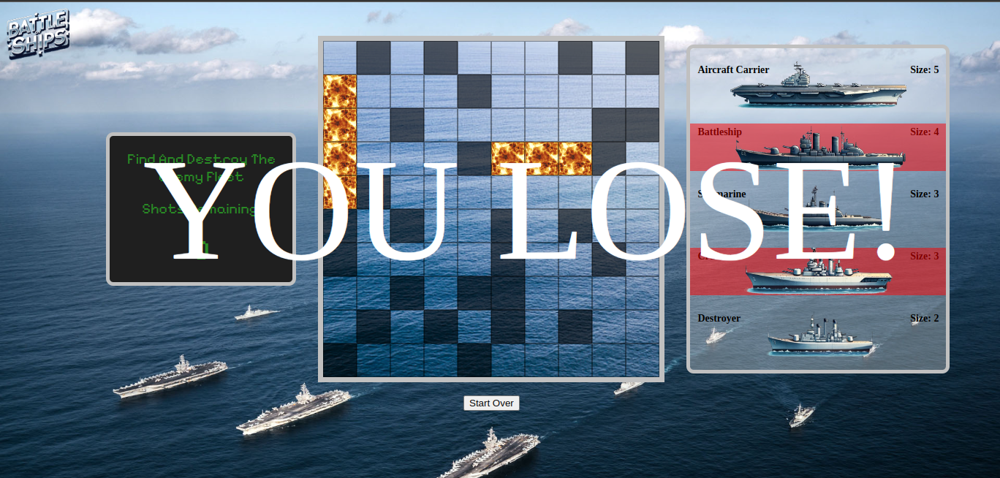

# Battle Of Ships

This is a game called Battle Of Ships that I made as my first project in the General Assembly software engineering immersive program. It is a version of Battleship.

# Screenshots

#

#

#

# Technologies

    -HTML
    -CSS
    -Javascript

# Copyright

All sounds and imagery used in the game are free of copyright.

# Link

Click here https://michaelbmoss.github.io/Static_Game-Battle_of_Ships/ to play the game. The gameplay is self-explanatory, especially if you've played Battleship before.

# Next Steps

There are many ways to improve the game from here. It would be easy to add difficulty levels by changing the number of chances one gets to shoot the enemy fleet. It would be great to have an attack and defend mode instead of just an attack mode. The code could be refactored.
